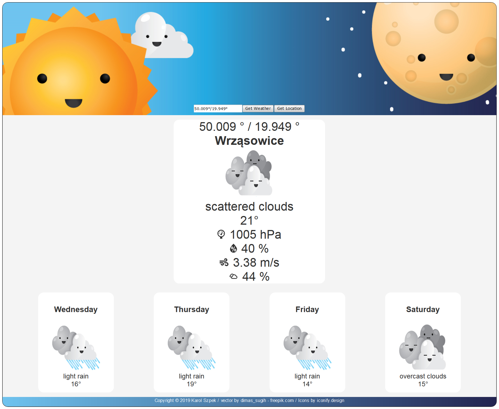
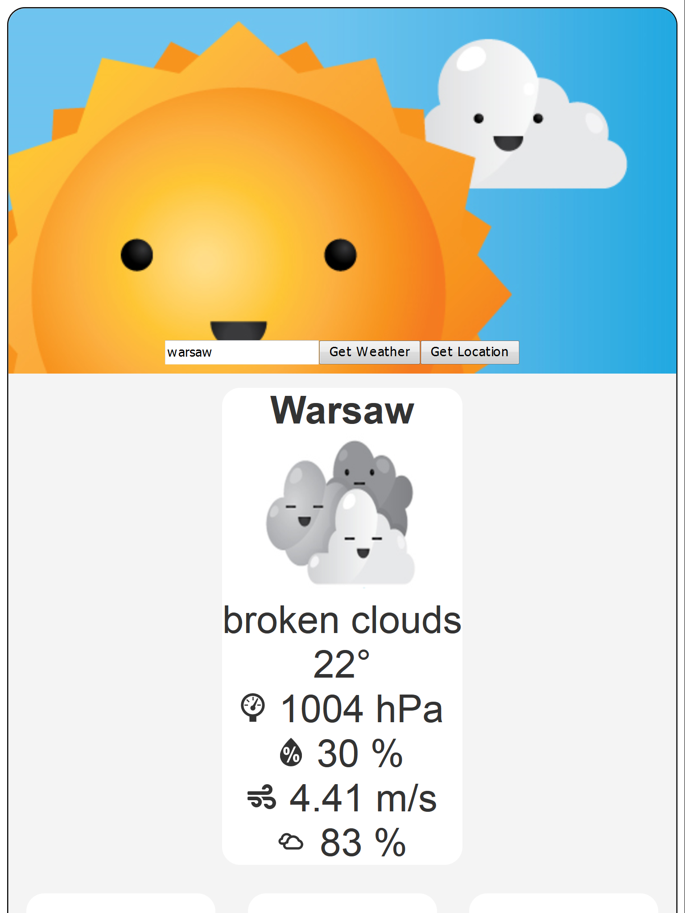
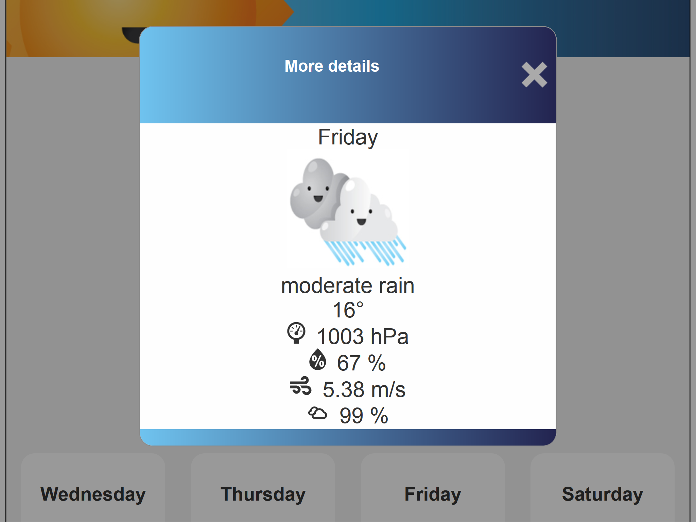
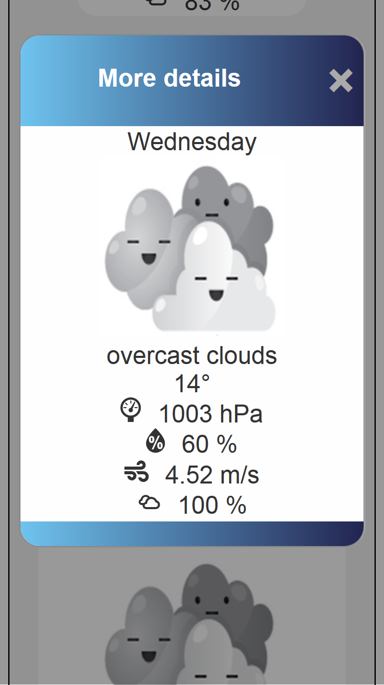
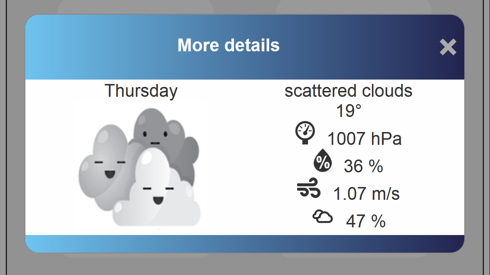

# Weather forecast app

## 1. LIVE DEMO: https://karolsz15.github.io/JS-weather-app/

## 2. DESCRIPTION

The application gets the data from the external Open Weather Map API (https://openweathermap.org/).

It uses two APIs to:
1) get weather by a city name searched by the user and 
2) get weather by a user's location

User can decide to search wether by city name or to search wether by location by clicking the proper button.
After fetching data from the external server proper .json file values are extracted from the file and then then
inserted in proper DOM elements by drawWeather function. 
User can click on seperate days icons to get more detailed information about the forecasted weather.

## 3. SCREENSHOTS:

### 1. Desktop view
 

### 2. Tablet portrait view
 

### 3. Tablet landsape view
 

### 4. Mobile portrait view
 

### 5. Mobile landsape view
 

